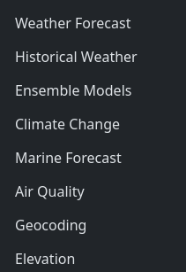
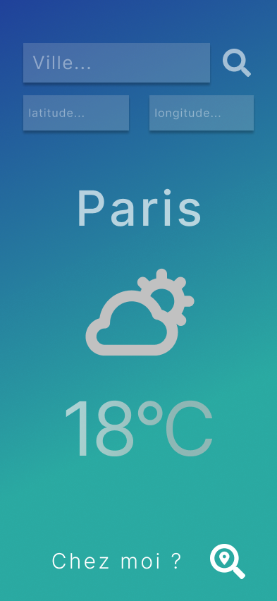

# Météo

Utilisez l'api REST https://open-meteo.com/en/docs pour conçevoir une petite application météo qui donne des informations météorologique lorsque l'on tape le nom d'une ville.

L'API REST open-meteo possède enfaite plusieurs APIs.

A vous d'utiliser les bon outils pour obtenir :
- Les informations météo en fonction de la position GPS (latitude, longitude)
- La position GPS (latitude, longitude) en fonction du nom de la ville.

## Maquette

https://www.figma.com/proto/SxzRQi4Gdf3NkEvVr0gvg5/Untitled?node-id=1-2&t=VxVuPYHtZZgQDDAg-1&scaling=scale-down&content-scaling=fixed&page-id=0%3A1

## Cahier des charges

|Tâche|
|-|
|Barre de recherche qui affiche la météo en fonction du position gps (latitude,longitude) tapez|
| Recherche en fonction du nom de la ville.|
| Afficher une image cohérante en fonction du temps.   - pluie -> image d'un nuage pluvieux - soleil -> image d'un soleil plein - etc...
| [BONUS] : Utilisez l'api native Geolocalisation pour afficher la météo de l'utilisateur des qu'il arrive sur le site : https://developer.mozilla.org/en-US/docs/Web/API/Geolocation_API/Using_the_Geolocation_API |
| [BONUS] - Changer la couleur de fond en fonction de l'heure (jour ou nuit).

## A propos de l'API Geolocalisation sur Firefox
L'implementation de l'API Geolocation depend du navigateur, il est donc possible que la geolocalisation ne fonctionne pas sur certain navigateurs comme Firefox ou Chromium.(A ma connaissance tout fonctionne bien sur Google Chrome).

Il faut prévoir le cas où l'utilisateur utilise un navigateur déféctueux.

Si l'API geolocalisation ne fonctionne pas sur un navigateur. Utilisez une API REST permettant de récupérer la position en fonction de l'IP.

Il en existe plusieurs mais vous pouvez utilisez celle de google.

https://developers.google.com/maps/documentation/geolocation/overview?hl=fr